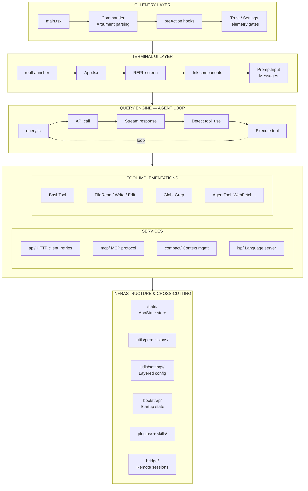
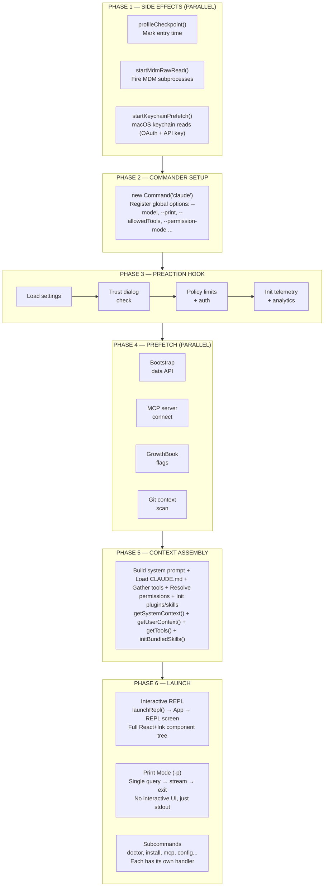
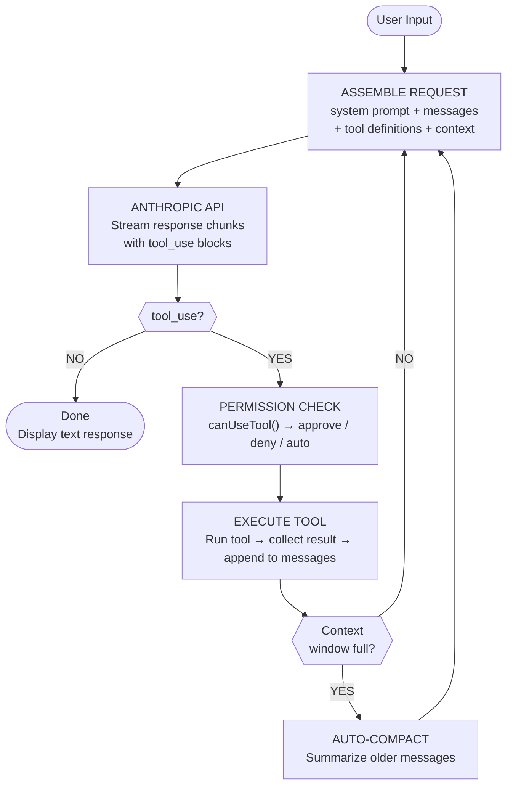
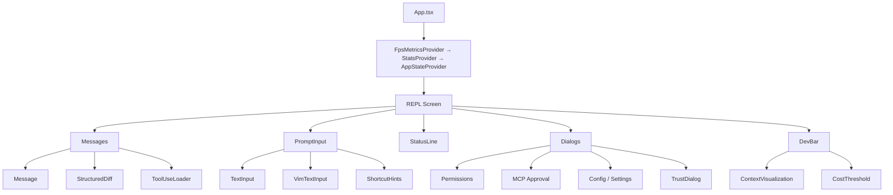

# Claude Code -- Architecture Guide

A comprehensive architectural guide to Anthropic's CLI agent -- recovered from the npm source map leak of March 31, 2026. This guide maps every major subsystem, data flow, and design decision in the ~1,900 file TypeScript codebase.

- **Language:** TypeScript + React/Ink
- **Runtime:** Bun
- **Size:** ~512k lines of code
- **Leaked:** 2026-03-31

---

## 01 -- At a Glance

| Metric | Value |
|---|---|
| Source Files | ~1,900 |
| Lines of Code | 512k+ |
| Built-in Tools | 40+ |
| Slash Commands | 50+ |
| Directories | 30+ |

---

## 02 -- Tech Stack

Claude Code is a Bun-bundled CLI whose terminal interface is built entirely with React + Ink -- React components rendered to the terminal instead of a browser.

- **TypeScript** -- The entire codebase is TypeScript with strict types. Zod schemas validate external inputs. Heavy use of branded types for safety.
- **Bun Runtime & Bundler** -- Uses `bun:bundle` feature flags for dead-code elimination. Bun's fast startup and native APIs power the CLI.
- **React + Ink** -- Terminal UI built as React components rendered via Ink. Full component tree with context providers, hooks, and state management.
- **Commander.js** -- CLI argument parsing via `@commander-js/extra-typings`. Subcommands, options, and preAction hooks for the `claude` binary.
- **Anthropic SDK** -- The official `@anthropic-ai/sdk` for API calls, with custom retry logic, rate limiting, and streaming support.
- **Model Context Protocol** -- Full MCP client for connecting to external tool servers -- stdio, SSE, and SDK transports. OAuth + enterprise auth paths.

---

## 03 -- Architecture Layers

The codebase is organized in concentric layers, from the CLI entry point down to individual tool implementations.

### Mermaid Diagram

### Text Summary

1. **CLI Entry Layer** -- `main.tsx` -> Commander parsing -> preAction hooks -> trust / settings / telemetry gates
2. **Terminal UI Layer** -- `replLauncher` -> `App.tsx` -> REPL screen -> Ink components -> PromptInput / Messages
3. **Query Engine (Agent Loop)** -- `query.ts` -> API call -> stream response -> detect tool_use -> execute tool -> loop back
4. **Services** -- `api/` (HTTP client, retries), `mcp/` (MCP protocol client), `compact/` (context mgmt), `lsp/` (language server)
5. **Tool Implementations** -- BashTool, FileRead/Write/Edit, Glob, Grep, Agent, WebFetch...
6. **Infrastructure & Cross-Cutting** -- `state/` (AppState store), `utils/permissions/`, `utils/settings/` (layered config), `bootstrap/` (startup state), `hooks/` (React hooks library), `services/analytics/` (telemetry), `plugins/ + skills/` (extensibility), `utils/sessionStorage` (persistence), `bridge/` (remote/web sessions)

---

## 04 -- Startup Flow

What happens when you type `claude` in your terminal -- from process start to interactive REPL.

### Mermaid Diagram

### Phase Breakdown

1. **Phase 1 -- Side Effects (Parallel)**
   - `profileCheckpoint()` -- Mark entry time
   - `startMdmRawRead()` -- Fire MDM subprocesses
   - `startKeychainPrefetch()` -- macOS keychain reads (OAuth + API key)

2. **Phase 2 -- Commander Setup**
   - `new Command('claude')` -- Register global options (`--model`, `--print`, `--allowedTools`, `--permission-mode` ...)

3. **Phase 3 -- preAction Hook**
   - Load settings -> Trust dialog check -> Policy limits + auth -> Init telemetry + analytics

4. **Phase 4 -- Prefetch (Parallel)**
   - Bootstrap data API
   - MCP server connect
   - GrowthBook flags
   - Git context scan

5. **Phase 5 -- Context Assembly**
   - Build system prompt + Load CLAUDE.md + Gather tools + Resolve permissions + Init plugins/skills
   - `getSystemContext()` + `getUserContext()` + `getTools()` + `initBundledSkills()`

6. **Phase 6 -- Launch**
   - **Interactive REPL** -- `launchRepl()` -> App -> REPL screen. Full React+Ink component tree.
   - **Print Mode (`-p`)** -- Single query -> stream -> exit. No interactive UI, just stdout.
   - **Subcommands** -- `doctor`, `install`, `mcp`, `config`... Each has its own handler.

---

## 05 -- The Query Loop (Agent Loop)

The heart of Claude Code. When you send a message, it enters an agentic loop that calls tools, observes results, and continues until the task is done.

### Mermaid Diagram

### Flow Summary

1. **User Input** enters the loop
2. **Assemble Request** -- system prompt + messages + tool definitions + context
3. **Anthropic API** -- Stream response chunks with tool_use blocks
4. **Decision: tool_use?**
   - **NO** -> Done (display text response)
   - **YES** -> Permission Check -> Execute Tool -> check context window -> loop back
5. **Auto-Compact** -- When the context window fills, summarize older messages before looping back

---

## 06 -- Directory Map

Every major directory in `src/` and what it contains.

- **`main.tsx`** -- The single entry point. Sets up Commander, registers all options and subcommands, runs preAction gates, then dispatches to REPL, print mode, or subcommand handlers. (`src/main.tsx`, ~800 lines)

- **`query.ts` -- Agent Loop** -- The core agentic loop. Assembles messages, calls the Anthropic API, streams responses, detects tool_use blocks, runs permission checks, executes tools, and loops. (`src/query.ts`)

- **`components/`** -- 150+ React/Ink components for the terminal UI -- App.tsx, Messages, PromptInput, StatusLine, diff viewers, dialogs, settings panels, MCP approvals, onboarding wizards. (`src/components/`)

- **`tools/`** -- 40+ tool implementations the model can invoke: BashTool, FileReadTool, FileWriteTool, FileEditTool, GlobTool, GrepTool, AgentTool, WebFetchTool, TaskTools, and more. (`src/tools/`)

- **`services/`** -- Backend services -- API client with retries, MCP protocol client (stdio/SSE/SDK transports), session compaction, LSP integration, analytics, OAuth, rate limiting. (`src/services/`)

- **`utils/`** -- The largest directory. Permissions system, settings (layered config), git integration, auth, session storage, message handling, swarm/teammate backends, deep links. (`src/utils/`)

- **`bridge/`** -- Remote session support -- WebSocket/SSE transports for the web app (claude.ai/code). Bridge config, messaging, JWT auth, session runners, polling. (`src/bridge/`)

- **`commands/`** -- 50+ slash commands: /commit, /review, /compact, /config, /mcp, /doctor, /help, /vim, /theme, /tasks, /skills, /agents, /bridge, /teleport, and many more. (`src/commands/`)

- **`state/`** -- AppState store with React context. Centralized state for the current session -- messages, model, permissions, tools, input mode, and UI state. (`src/state/`)

- **`hooks/`** -- React hooks library -- useCanUseTool (permission logic), useMessageStream, useCostTracker, useKeyboard, and many more. (`src/hooks/`)

- **`plugins/` + `skills/`** -- Plugin system for extensibility -- bundled plugins, skill loading, marketplace integration, telemetry. Skills are a higher-level abstraction on top of plugins. (`src/plugins/` + `src/skills/`)

- **`coordinator/`** -- Multi-agent coordination mode (feature-gated behind COORDINATOR_MODE). Orchestrates multiple agent instances working together. (`src/coordinator/`)

- **`assistant/`** -- KAIROS mode -- assistant/Agent SDK-oriented mode. Session history, gating logic. Feature-gated, not in standard builds. (`src/assistant/`)

- **`voice/` + `vim/` + `buddy/`** -- Product features: voice input (STT), vim-style editing keybindings, companion sprite ("Quartz" the owl). Each feature-gated independently. (`src/voice/` + `src/vim/` + `src/buddy/`)

---

## 07 -- Tool Registry

Every tool the model can invoke. Tools are registered in `tools.ts` and exposed to the API via JSON schema definitions. Each tool implements a standard interface with `Tool` type.

### Core Tools (Always Available)

| Tool | Description | Path |
|---|---|---|
| BashTool | Execute shell commands. Sandboxed, with timeout support. | `tools/BashTool/` |
| FileReadTool | Read files (text, images, PDFs, notebooks). Line-range support. | `tools/FileReadTool/` |
| FileWriteTool | Create or overwrite files. | `tools/FileWriteTool/` |
| FileEditTool | Surgical string replacements in files (old_string -> new_string). | `tools/FileEditTool/` |
| GlobTool | Fast file pattern matching across the codebase. | `tools/GlobTool/` |
| GrepTool | Regex content search (built on ripgrep). | `tools/GrepTool/` |
| WebFetchTool | Fetch content from URLs, rendered to markdown. | `tools/WebFetchTool/` |
| WebSearchTool | Web search via external search provider. | `tools/WebSearchTool/` |
| AgentTool | Launch sub-agents for parallel work. Different agent types. | `tools/AgentTool/` |
| SkillTool | Invoke skills (slash-command plugins). | `tools/SkillTool/` |

### Task & Planning Tools

| Tool | Description | Path |
|---|---|---|
| TaskCreateTool | Create tracked tasks for progress visibility. | `tools/TaskCreateTool/` |
| TaskUpdateTool | Update task status (in_progress, completed). | `tools/TaskUpdateTool/` |
| TaskGetTool | Get details of a specific task. | `tools/TaskGetTool/` |
| TaskListTool | List all tasks in the session. | `tools/TaskListTool/` |
| TaskOutputTool | Read output from background tasks. | `tools/TaskOutputTool/` |
| TaskStopTool | Stop a running background task. | `tools/TaskStopTool/` |
| EnterPlanModeTool | Enter structured planning mode. | `tools/EnterPlanModeTool/` |
| ExitPlanModeTool | Exit plan mode, resume execution. | `tools/ExitPlanModeTool/` |
| TodoWriteTool | Write TODO items for tracking. | `tools/TodoWriteTool/` |

### Collaboration & Extensibility Tools

| Tool | Description | Path |
|---|---|---|
| AskUserQuestionTool | Pause execution to ask the user a question. | `tools/AskUserQuestionTool/` |
| SendMessageTool | Send messages to other agents (teammate system). | `tools/SendMessageTool/` |
| TeamCreateTool | Create a new teammate agent. | `tools/TeamCreateTool/` |
| TeamDeleteTool | Remove a teammate agent. | `tools/TeamDeleteTool/` |
| MCPTool | Dynamically-registered tools from MCP servers. | `tools/MCPTool/` |
| LSPTool | Language Server Protocol integration tool. | `tools/LSPTool/` |
| NotebookEditTool | Edit Jupyter notebook cells. | `tools/NotebookEditTool/` |
| ToolSearchTool | Search for deferred/lazy-loaded tools. | `tools/ToolSearchTool/` |
| EnterWorktreeTool | Create isolated git worktree for parallel work. | `tools/EnterWorktreeTool/` |
| ExitWorktreeTool | Exit and clean up a worktree. | `tools/ExitWorktreeTool/` |

### Feature-Gated Tools

| Tool | Description | Feature Gate |
|---|---|---|
| SleepTool | Pause execution (PROACTIVE / KAIROS modes). | `PROACTIVE`, `KAIROS` |
| CronCreate/Delete/List | Schedule recurring agent runs. | `AGENT_TRIGGERS` |
| RemoteTriggerTool | Trigger remote agent execution. | `AGENT_TRIGGERS_REMOTE` |
| SendUserFileTool | Send files to the user (assistant mode). | `KAIROS` |
| PushNotificationTool | Send push notifications. | `KAIROS` |
| REPLTool | Interactive REPL (Anthropic-internal). | ant-only |

---

## 08 -- Services

Backend services that the query loop and tools depend on.

### services/api/ -- HTTP Client

The Anthropic API client. Handles streaming responses, retries with exponential backoff (`withRetry.ts`), rate limit handling, and fallback models. Includes `bootstrap.ts` for initial data fetch, `filesApi.ts` for session file transfers, and `referral.ts` for subscription/passes checking. All API calls flow through this service with consistent error handling.

### services/mcp/ -- Model Context Protocol

Full MCP client implementation. Supports three transports: `stdio` (local subprocess), `SSE` (server-sent events), and `SDK` (in-process). Config parsing from `.claude/mcp.json` files, connection lifecycle management, OAuth authentication for remote servers, enterprise XAA (cross-account access) paths, and the official MCP registry for Anthropic-maintained servers.

### services/compact/ -- Context Compaction

When the conversation approaches the context window limit, compaction kicks in. It summarizes older messages while preserving recent context. `autoCompact.ts` monitors token usage and triggers automatically. `compact.ts` builds the compacted message array. Reactive compaction (feature-gated) does more aggressive, on-the-fly compression.

### services/lsp/ -- Language Server Protocol

Optional LSP integration provides IDE-like features: go-to-definition, find-references, diagnostics. Used by the LSPTool to give the model structured code intelligence beyond simple text search. Connects to language servers for TypeScript, Python, and other supported languages.

### services/analytics/ -- Telemetry & Feature Flags

Analytics pipeline with privacy controls (`isAnalyticsDisabled()`). GrowthBook integration for feature flags and A/B testing. Event logging (`logEvent()`) with metadata validation to prevent accidental code/filepath leakage (the type name `AnalyticsMetadata_I_VERIFIED_THIS_IS_NOT_CODE_OR_FILEPATHS` serves as a compile-time reminder).

### services/policyLimits/ + remoteManagedSettings/

Enterprise features. `policyLimits` enforces organization-level policies (which tools are allowed, model restrictions, etc.). `remoteManagedSettings` pulls configuration from Anthropic's servers for managed deployments. Both integrate with MDM (Mobile Device Management) for corporate environments.

### services/plugins/ -- Plugin System

Plugin loading, versioning, and lifecycle management. Plugins can provide tools, commands, and skills. Supports bundled plugins (shipped with Claude Code), user-installed plugins from marketplaces, and managed plugins for enterprise. Includes cache management to clean up orphaned plugin versions.

---

## 09 -- Terminal UI Architecture

Claude Code's terminal interface is a full React application rendered to the terminal via Ink. Here's the component hierarchy.

### Mermaid Diagram

### Component Tree Summary

- **App.tsx** (root)
  - FpsMetricsProvider -> StatsProvider -> AppStateProvider
    - **REPL Screen**
      - **Messages** -- Message, StructuredDiff, ToolUseLoader
      - **PromptInput** -- TextInput, VimTextInput, ShortcutHints
      - **StatusLine**
      - **Dialogs** -- Permissions, MCP Approval, Config / Settings, TrustDialog
      - **DevBar** -- ContextVisualization, CostThreshold

The entire UI is React components rendered to the terminal via Ink. State flows down via context providers. User input flows up via callbacks and the message queue.

---

## 10 -- Feature Flags & Dead Code Elimination

Claude Code uses Bun's `bun:bundle` feature flags for compile-time dead code elimination. Code gated behind a disabled flag is completely removed from the bundle.

- **KAIROS** -- Assistant/Agent SDK mode. Enables session history, SleepTool, SendUserFileTool, PushNotificationTool, and the full `assistant/` module.
- **BRIDGE_MODE** -- Enables the `bridge/` subsystem for remote sessions via claude.ai/code. WebSocket + SSE transports, JWT auth, session runners.
- **COORDINATOR_MODE** -- Multi-agent coordination. The `coordinator/` module orchestrates multiple Claude instances working on different parts of a task.
- **PROACTIVE** -- Proactive mode -- Claude can take actions without explicit user requests. Enables SleepTool for timed waits.
- **VOICE_MODE** -- Voice input via speech-to-text. Enables the `voice/` subsystem and voice commands.
- **AGENT_TRIGGERS** -- Scheduled agent runs via cron. CronCreate/Delete/List tools. AGENT_TRIGGERS_REMOTE adds remote trigger support.
- **REACTIVE_COMPACT** -- More aggressive on-the-fly context compaction. Compresses context reactively as it grows.
- **WORKFLOW_SCRIPTS** -- User-defined workflow scripts that can be triggered as commands.

Feature flags are checked via `feature('FLAG_NAME')` from `bun:bundle`. When a flag is off, the conditional import is eliminated at bundle time, keeping the shipped binary lean.

---

## 11 -- Slash Commands

Commands available to the user in the interactive REPL. Each command is a module in `src/commands/`.

| Command | Description |
|---|---|
| `/compact` | Compress context |
| `/commit` | Git commit helper |
| `/review` | Code review |
| `/config` | Edit settings |
| `/mcp` | Manage MCP servers |
| `/doctor` | Diagnose issues |
| `/clear` | Clear conversation |
| `/cost` | Show token usage |
| `/help` | Show help topics |
| `/skills` | Manage skills |
| `/tasks` | Task management |
| `/vim` | Toggle vim mode |
| `/theme` | Change theme |
| `/resume` | Resume session |
| `/diff` | Show file changes |
| `/memory` | Manage memory |
| `/teleport` | Transfer session |
| `/agents` | Agent management |
| `/share` | Share conversation |
| `/ide` | IDE integration |
| `/login` | Authenticate |

---

## 12 -- Key Design Patterns

### 1. Parallel Side-Effect Imports

`main.tsx` fires expensive I/O (MDM reads, keychain prefetch) as side effects of import statements, so they run during module evaluation before the rest of the app loads. This shaves ~65ms off macOS startup.

### 2. Compile-Time Feature Flags

`feature('FLAG')` from `bun:bundle` enables dead code elimination. Conditional `require()` calls guarded by feature flags are completely removed when the flag is off, keeping the shipped binary small.

### 3. Lazy Require for Circular Dependencies

Several modules use `const getFoo = () => require('./Foo')` to break circular dependency chains (e.g., tools.ts <-> TeamCreateTool, main.tsx <-> teammate utilities).

### 4. Layered Configuration

Settings come from multiple sources with priority: CLI flags > environment variables > user settings > project settings > remote managed settings > MDM policy > defaults. `utils/settings/` merges them.

### 5. Permission System

Every tool use goes through a permission check. Three modes: **default** (ask for dangerous ops), **auto** (approve most), **manual** (ask for everything). Permission results are cached per-session. The system tracks denial patterns for analytics.

### 6. React for the Terminal

Using Ink means the terminal UI gets React's component model, hooks, context, and reconciliation. Components like Messages, PromptInput, and StatusLine are React components with state and lifecycle -- just rendered to ANSI escape codes instead of DOM.

### 7. Teammate / Swarm Architecture

`utils/swarm/` manages multi-agent "teammate" flows. Backends include tmux (separate terminal panes), iTerm (native tabs), and in-process runners. Agents can send messages to each other and sync permissions.
