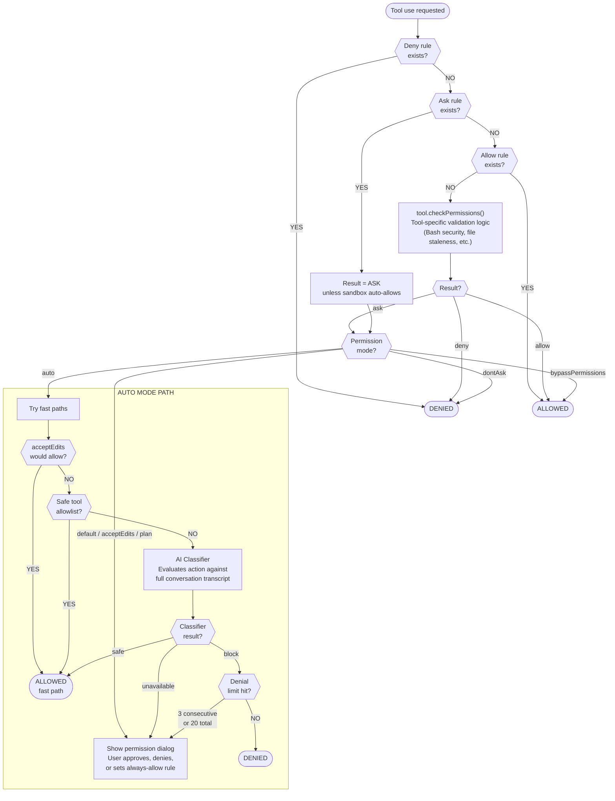
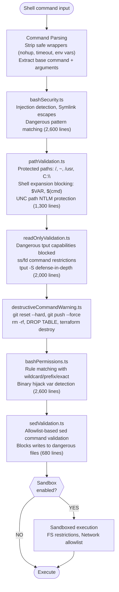
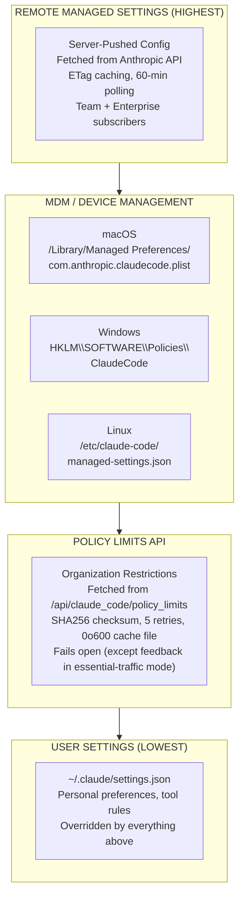

# Security of Claude Code

How Anthropic's CLI agent limits, approves, and gates every action it takes -- from a single shell command to multi-agent swarm coordination. This guide maps every security layer and how they interlock.

> **Core principle: defense-in-depth.** No single layer is the security boundary. Permission modes, tool-specific validators, path checks, sandbox enforcement, enterprise policies, and AI classifiers all stack. A bypass in one layer is caught by the next.

---

## 01 -- Defense-in-Depth Layers

Seven concentric layers protect the user's system. Every tool invocation must pass through all of them -- outermost first.

```mermaid
flowchart TD
    TOOL_USE["Model requests tool_use"]

    subgraph L1["LAYER 1 -- ENTERPRISE POLICY"]
        POL["Policy Limits\nOrg-level tool restrictions via API"]
        MDM["MDM Settings\nmacOS plist / Windows registry"]
        REMOTE["Remote Managed Settings\nServer-pushed config overrides"]
    end

    subgraph L2["LAYER 2 -- PERMISSION RULES"]
        direction LR
        DENY["Deny rules\nExplicit blocks (highest priority)"]
        ASK["Ask rules\nRequire user/classifier approval"]
        ALLOW["Allow rules\nPre-approved tool patterns"]
    end

    subgraph L3["LAYER 3 -- PERMISSION MODE"]
        MODE["Mode gate\ndefault / acceptEdits / plan / auto / bypassPermissions"]
    end

    subgraph L4["LAYER 4 -- TOOL-SPECIFIC VALIDATION"]
        direction LR
        BASH_V["Bash: 12k lines\nCommand parsing, injection\ndetection, path validation"]
        FILE_V["File: staleness\nRead-before-write, UNC\nblocking, encoding checks"]
        AGENT_V["Agent: tool filter\nHardcoded disallowed\ntool lists per agent type"]
    end

    subgraph L5["LAYER 5 -- SANDBOX ENFORCEMENT"]
        SANDBOX["Runtime sandbox\nFilesystem read/write restrictions\nNetwork host allowlists\nManaged domain-only mode"]
    end

    subgraph L6["LAYER 6 -- HARD BLOCKS (UNBYPASSABLE)"]
        direction LR
        PATHS["Protected paths\n/, ~, /usr, C:\\Windows"]
        SECRETS["Secret guards\nTeam memory, UNC/NTLM"]
        SHELL["Shell expansion\n$VAR, $(cmd) blocked"]
    end

    subgraph L7["LAYER 7 -- USER APPROVAL UI"]
        DIALOG["Permission dialog\nTool-specific preview with approve / deny / always-allow options"]
    end

    EXECUTE(["Execute tool"])

    TOOL_USE --> L1
    L1 --> L2
    L2 --> L3
    L3 --> L4
    L4 --> L5
    L5 --> L6
    L6 --> L7
    L7 --> EXECUTE
```

---

## 02 -- Permission Modes

The mode determines how `ask` decisions are resolved. Users can cycle modes with Shift+Tab or set one via CLI/settings.

| Mode | Behavior for "ask" decisions | Risk |
|------|------------------------------|------|
| `default` | Shows permission dialog for every action that isn't pre-allowed by rules. User must approve or deny each one. | Safest |
| `acceptEdits` | Auto-allows file reads, writes, and edits within the current working directory. Still prompts for shell commands, network access, and operations outside CWD. | Low |
| `plan` | Pauses before execution to show a detailed plan. When combined with auto mode, the AI classifier evaluates each step. | Low |
| `auto` | AI classifier evaluates each action against the conversation transcript. Safe tools auto-approved via allowlist fast path. Dangerous patterns are blocked. Falls back to interactive prompts after 3 consecutive or 20 total denials. | Medium |
| `dontAsk` | Converts every `ask` to `deny`. The model can only use pre-allowed tools. For automated/CI pipelines where no human is present. | Restrictive |
| `bypassPermissions` | Skips all permission checks. Equivalent to answering "yes" to everything. Can be remotely disabled via Statsig gate `tengu_disable_bypass_permissions_mode`. | Dangerous |

> **Auto mode strips dangerous permissions.** When entering auto mode, permission rules that would bypass the classifier (like `Bash(*)` or `Bash(python:*)`) are temporarily removed and stashed. They're restored when leaving auto mode.

---

## 03 -- Permission Decision Flow

Every tool invocation runs through `hasPermissionsToUseTool()` -- a 1,500+ line decision engine in `permissions.ts`. Here's the full flow.

### Rule Sources (Priority Order)

Permission rules come from multiple sources. When sources conflict, earlier sources win:

1. **CLI Flags** -- `--allowedTools "Bash(prefix:npm)"` and `--disallowedTools "WebFetch"` -- highest priority, set at launch.
2. **Policy Settings** -- Organization-level rules pushed from Anthropic's API. Enterprise admins can restrict tools globally.
3. **User Settings** -- `~/.claude/settings.json` -- personal allow/deny rules that persist across sessions.
4. **Project Settings** -- `.claude/settings.json` in the project root -- team-shared rules committed to the repo.
5. **Session Rules** -- Temporary rules from "always allow" choices in the permission dialog. Cleared when the session ends.

---

## 04 -- Auto Mode & AI Classifier

Auto mode uses an AI classifier to evaluate each action against the conversation context. But it has multiple safety rails to prevent runaway approvals.

### Safe Tool Allowlist (No Classifier Needed)

These tools are auto-approved without calling the classifier:

- **Read-Only Tools** -- FileRead, Grep, Glob, LSP, ToolSearch, ListMcpResources, ReadMcpResource -- can't modify anything.
- **Task Management** -- TaskCreate, TaskGet, TaskUpdate, TaskList -- only track internal state, no side effects.
- **User Interaction** -- AskUserQuestion, EnterPlanMode, ExitPlanMode -- involve user in the loop.
- **Coordination** -- TeamCreate, TeamDelete, SendMessage, Sleep -- orchestration primitives.

### Dangerous Permission Stripping

When entering auto mode, rules that would bypass the classifier are **temporarily removed**:

| Pattern | Why it's dangerous |
|---------|--------------------|
| `Bash(*)` | Allows all shell commands without classifier evaluation |
| `Bash(python:*)` | Python can execute arbitrary code -- shell-within-a-shell |
| `Bash(node:*)`, `Bash(ruby:*)`, etc. | Same escape risk via interpreter prefix |
| `Agent(*)` | Would auto-approve spawning sub-agents before classifier sees the prompt |

### Denial Tracking Circuit Breaker

> **After 3 consecutive denials or 20 total denials**, auto mode stops blocking and falls back to interactive permission prompts. This prevents the classifier from silently deadlocking a session. Counters reset when the total limit is hit.

---

## 05 -- Bash Tool Security

The Bash tool has the deepest security surface -- **~12,400 lines of validation code** across 18 files. Every command is parsed, analyzed, and gated before execution.

### Key Protections

<strong>Dangerous Removal Path Blocking</strong>

Hard-blocks `rm` and `rmdir` on critical paths -- **not bypassable by any permission rule**:

- `/` (root), `~` (home dir), Direct root children (`/usr`, `/tmp`, `/etc`, `/var`)
- Windows drive roots (`C:\`, `D:\`) and direct children (`C:\Windows`, `C:\Users`)
- Wildcards (`*`, `/*`) always rejected regardless of path.

<strong>Shell Expansion Blocking</strong>

Path arguments are checked for shell expansion syntax that could redirect operations:

- `$VAR` and `${VAR}` -- environment variable expansion
- `$(cmd)` -- command substitution
- `%VAR%` -- Windows environment variables
- `=cmd` -- Zsh equals expansion
- `~user`, `~+`, `~-` -- tilde variants that `expandTilde()` can't handle safely
- UNC paths (`\\hostname\share`) -- prevents NTLM credential leaks on Windows

<strong>Destructive Git Operation Warnings</strong>

These git commands trigger explicit warnings and require higher permission levels:

- `git reset --hard`, `git push --force`, `git branch -D`
- `git stash drop`, `git checkout .`, `git clean -f`
- `--no-verify` (hook bypass), `--amend` on published commits
- Also: `DROP TABLE`, `TRUNCATE`, `kubectl delete`, `terraform destroy`

---

## 06 -- File Operation Safety

File write and edit tools enforce staleness checks, path validation, and secret guards before touching the filesystem.

1. **Read-Before-Write Requirement** -- The model must have read a file (via FileReadTool) before it can write or edit it. Prevents blind overwrites. Tracked via read timestamps.
2. **Staleness Detection** -- Before writing, the tool checks if the file has been modified since the last read -- comparing both timestamp and content. If modified externally, the write is rejected.
3. **UNC Path Blocking** -- Paths starting with `\\` or `//` are blocked to prevent NTLM credential leaks via Windows SMB authentication.
4. **Team Memory Secret Guard** -- `checkTeamMemSecrets()` prevents writing secrets to shared team memory files -- credentials would be visible to teammates.
5. **Deny Rules Override Allow** -- Even with an allowlist match, an explicit deny rule always blocks. Prevents privilege escalation through rule confusion.
6. **Size & Encoding Safety** -- FileEditTool rejects files over 1 GiB (V8 string limit). Auto-detects UTF-16LE vs UTF-8. Normalizes CRLF line endings cross-platform.

---

## 07 -- Agent & Sub-Agent Restrictions

When Claude spawns sub-agents, they operate with **restricted tool sets** -- hardcoded lists that can't be overridden by rules or permissions.

| Agent Type | Blocked Tools | Why |
|------------|---------------|-----|
| **All Agents** | `TaskOutput`, `ExitPlanMode`, `EnterPlanMode`, `AskUserQuestion`, `TaskStop` | Sub-agents can't control the parent session's planning state or prompt the user directly |
| **All Agents (default)** | `AgentTool` | Prevents recursive agent spawning (no agent inception). Overridden for Anthropic-internal users. |
| **Async Agents** | Only allowed: FileRead/Write/Edit, Bash, Grep, Glob, WebSearch, WebFetch, Skill, TodoWrite, NotebookEdit, Worktree tools | Background agents get a strict allowlist -- no task management, no user interaction |
| **In-Process Teammates** | Limited to: TaskCreate/Get/List/Update, SendMessage, Cron tools | Teammates coordinate via messages, not direct tool use |

> **MCP tools are always allowed for agents.** This is a deliberate exception -- external MCP tools have their own approval flow and are considered pre-vetted by the server approval step.

---

## 08 -- Hard Blocks (Unbypassable)

These protections fire regardless of permission mode, rules, or user choices. They are **not overridable**.

- **Protected Removal Paths** -- `/`, `~`, `/usr`, `/tmp`, `/etc`, `C:\`, `C:\Windows`, `C:\Users`. No `rm` or `rmdir` on these, ever. Wildcards (`*`) rejected in all removal paths.
- **Shell Expansion in Paths** -- `$VAR`, `${VAR}`, `$(cmd)`, `%VAR%`, `=cmd` blocked in file path arguments. Prevents TOCTOU attacks and redirect-through-expansion.
- **UNC / NTLM Credential Protection** -- `\\hostname\share` paths blocked in file ops and bash. Prevents Windows SMB auto-authentication leaking NTLM hashes to attacker-controlled servers.
- **Team Memory Secret Guard** -- Secrets and credentials cannot be written to shared team memory files -- even with full file write permissions.
- **Glob Patterns in Write Paths** -- File write/edit operations require exact paths. Glob patterns like `*.ts` are rejected -- prevents accidental mass overwrites.
- **Agent Tool Disallow Lists** -- Hardcoded in constants -- sub-agents can never use `AskUserQuestion`, `TaskStop`, or spawn recursive agents.

---

## 09 -- Trust Model

Before Claude Code can operate in a directory, the user must accept a trust dialog that discloses what capabilities the project configuration enables.

### Trust Dialog Checks

The dialog scans the project and surfaces what needs approval:

| Check | What it detects |
|-------|-----------------|
| MCP Servers | Project-scoped MCP servers in `.claude/mcp.json` that would connect to external services |
| Hooks | Custom hooks in settings that run shell commands on tool events |
| Bash Execution | Permission rules, slash commands, or skills that would enable shell access |
| API Key Helper | External auth token sources configured in settings |
| AWS / GCP Commands | Cloud credential commands that could incur costs or access resources |
| Dangerous Env Vars | Restricted environment variables in the project config |

### Trusted Device System

For remote/bridge sessions, a **trusted device token** provides elevated authentication:

1. **Enrollment** -- During `/login`, a POST to `/auth/trusted_devices` registers the device. Must happen within 10 minutes of login.
2. **Token Storage** -- 90-day rolling-expiry token stored in the macOS keychain. Sent as `X-Trusted-Device-Token` header on bridge calls.
3. **Gate** -- Controlled by feature flag `tengu_sessions_elevated_auth_enforcement`. Server requires `SecurityTier=ELEVATED`.

---

## 10 -- Enterprise Security Controls

Three layers of enterprise configuration -- all overriding user settings -- ensure organizations can enforce security policies.

### Remote Kill Switches

| Gate | Effect |
|------|--------|
| `tengu_disable_bypass_permissions_mode` | Remotely disables bypassPermissions mode for all users in the org |
| `tengu_auto_mode_config.enabled` | Circuit breaker for auto mode -- can be disabled remotely via GrowthBook |
| `sandbox.network.allowManagedDomainsOnly` | Restricts all network access to enterprise-approved domains |

---

## 11 -- MCP Server Security

MCP (Model Context Protocol) servers connect Claude Code to external tools. Each server goes through its own approval pipeline.

1. **Channel Allowlist** -- Servers from marketplace plugins are checked against a GrowthBook-sourced allowlist (`tengu_harbor_ledger`). Unapproved servers require `--dangerously-load-development-channels`.
2. **Project Approval Dialog** -- Project-scoped MCP servers (in `.claude/mcp.json`) trigger an approval dialog via the trust system. Users can approve individually or in bulk.
3. **OAuth / XAA Authentication** -- Remote servers authenticate via RFC 8414 OAuth discovery. Enterprise XAA (Cross-App Access) uses a two-leg token exchange: `id_token` -> ID-JAG -> `access_token`.
4. **Structured Permission Relay** -- Channel permission requests use 5-letter codes (FNV-1a hash, alphabet excludes `l`) parsed server-side to prevent accidental approvals from stray text.
5. **Token Redaction** -- All tokens (`access_token`, `refresh_token`, `id_token`, `assertion`, `client_secret`) are regex-stripped from logs and debug output.

---

## 12 -- Credential Storage

Credentials are stored in the macOS Keychain with multiple fallback layers and anti-leak protections.

- **macOS Keychain (Primary)** -- Uses `security` CLI with `find-generic-password` / `add-generic-password`. 30-second TTL cache avoids repeated subprocess spawns. Cache generation tracking prevents race conditions.
  - `utils/secureStorage/macOsKeychainStorage.ts`
- **Plaintext Fallback (Secondary)** -- `.credentials.json` with `chmod 600`. Used when keychain is locked (common in SSH sessions). Automatically deleted when keychain becomes available.
  - `utils/secureStorage/plainTextStorage.ts`
- **Hex Encoding for Process Safety** -- Credentials over 4KB use hex encoding in CLI args: `Buffer.from(json).toString('hex')`. Prevents process monitors from seeing plaintext tokens.
  - `utils/secureStorage/macOsKeychainHelpers.ts`
- **Startup Prefetch** -- Keychain reads fire as side-effect imports at the top of `main.tsx` -- before the rest of the app loads. Saves ~65ms on macOS by parallelizing with module evaluation.
  - `utils/secureStorage/keychainPrefetch.ts`

### Stored Credentials

| Field | Purpose |
|-------|---------|
| `accessToken` | OAuth access token for Anthropic API |
| `refreshToken` | OAuth refresh token for token renewal |
| `idToken` | OpenID Connect ID token (used in XAA flows) |
| `trustedDeviceToken` | 90-day device authentication for bridge/remote sessions |
| `mcpOAuth[server]` | Per-MCP-server OAuth tokens (access + refresh) |

> **Stale-while-error pattern:** If the keychain is locked or a refresh fails, the cached credential is served rather than failing hard. This prevents session drops during transient keychain issues.
