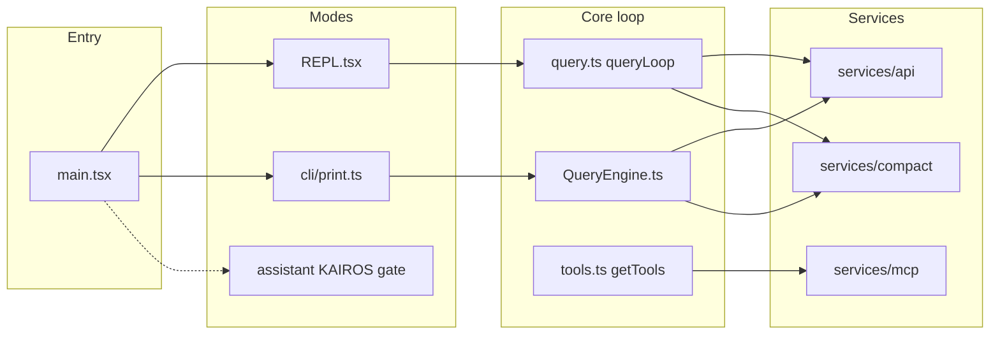

# Architecture

!!! warning "Recovered source"
Paths refer to `src/` in this repository. Line-level accuracy is best-effort from the source map reconstruction.

## High-level flow

## Entry and startup

`src/main.tsx` is the **Commander**-based CLI. Before the command handler runs, module evaluation triggers:

- Startup profiling checkpoints (`utils/startupProfiler.ts`)
- MDM raw reads in parallel (`utils/settings/mdm/rawRead.ts`)
- macOS keychain prefetch (`utils/secureStorage/keychainPrefetch.ts`)

The `preAction` hook loads trust, settings, telemetry gates, MCP prefetch, policy limits, and related startup work before interactive or print mode begins.

## Interactive mode

- `replLauncher.tsx` mounts the Ink/React app.
- `screens/REPL.tsx` owns the main session UI, input queue, model turns, tool execution UI, teammate hooks, voice (when compiled in), and scheduled-task integration.
- `utils/queueProcessor.ts` drains slash commands, bash-mode lines, and batched prompts into `executeInput`.

## Headless / print / SDK-style I/O

- `cli/print.ts` implements structured stdin/stdout loops (`runHeadlessStreaming`, NDJSON-style control).
- `QueryEngine.ts` supports non-REPL paths where messages are submitted programmatically and tool permission context is updated without full UI.

## Tools and MCP

- `tools.ts` aggregates built-in tools (filtered by permission context) and merges MCP-derived tools.
- `services/mcp/` implements config parsing, transports, OAuth, channel permissions, and the in-process MCP client used by `MCPConnectionManager` in the UI.

## Compaction and memory

- `services/compact/` implements context window management aligned with user-facing [context window](https://code.claude.com/docs/en/context-window) and [costs](https://code.claude.com/docs/en/costs) documentation.

## Multi-agent (swarm / teammates)

- `utils/swarm/` contains backends (tmux, iTerm, in-process), spawn utilities, permission sync, and `inProcessRunner.ts` teammate loop.

## IDE integration

- `bridge/` plus hooks such as `hooks/useDiffInIDE.ts` connect to VS Code / JetBrains surfaces described in official [VS Code](https://code.claude.com/docs/en/vs-code) and [JetBrains](https://code.claude.com/docs/en/jetbrains) docs.

## Key files (quick index)

| Path                                               | Role                                        |
| -------------------------------------------------- | ------------------------------------------- |
| `main.tsx`                                         | CLI entry, global options, `preAction`      |
| `screens/REPL.tsx`                                 | Interactive session core                    |
| `query.ts`                                         | Streaming query loop, tool round-trips      |
| `QueryEngine.ts`                                   | Headless query submission                   |
| `cli/print.ts`                                     | Print / stream-json / SDK control transport |
| `tools.ts` / `Tool.ts`                             | Tool registry and types                     |
| `services/api/client.ts`, `services/api/claude.ts` | HTTP / streaming API                        |
| `utils/permissions/`                               | Permission modes and prompts                |
| `services/compact/`                                | Compaction pipeline                         |
| `utils/sessionStart.ts`                            | Session / setup hooks                       |

See also [Workflows](workflows.md) and the [official docs map](official-docs-map.md).
